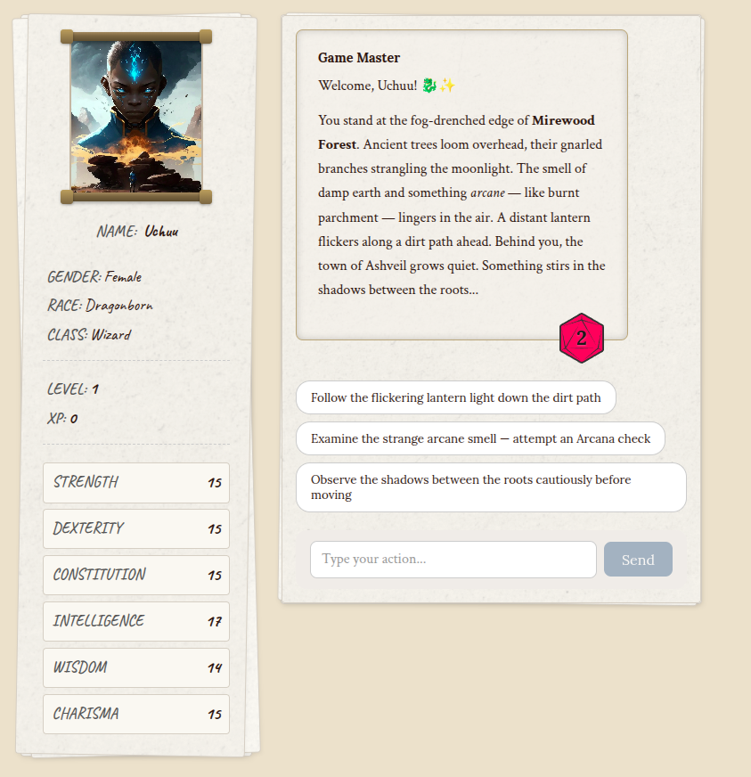
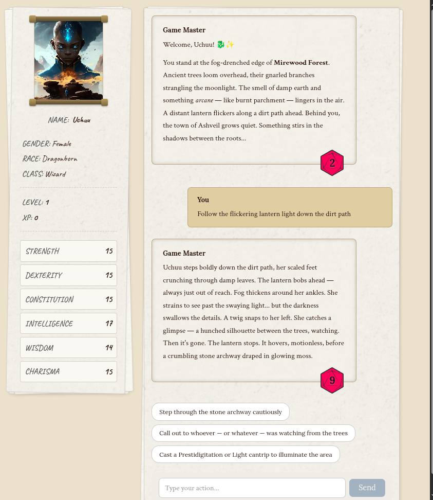

# Once Upon Agentic AI: A Developer's Epic Journey into the Strands SDK

> 📚 **This is my personal work-through of AWS's Strands SDK workshop.**
> I'm learning the Strands framework by completing the exercises in each
> chapter. This repo is forked from
> [aws-samples/sample-once-upon-agentic-ai](https://github.com/aws-samples/sample-once-upon-agentic-ai) —
> credit for the workshop design and content goes to the original AWS team.


_"Roll for Initiative... in Python!"_


Welcome, brave adventurer, to the ultimate Strands framework quest! This comprehensive workshop will transform you from a coding apprentice into a master of AI agent orchestration. Through five epic chapters, you'll learn to create, equip, and command digital companions that can think, act, and collaborate like a legendary adventuring party. Follow the instructions in the following [workshop](https://catalog.us-east-1.prod.workshops.aws/workshops/e1493217-4bc7-42f4-87d9-e231acd743bc/en-US/0-pre-requisites).

## 🛠️ Setup

Dependencies are declared in `pyproject.toml` — that's the single source of truth for both `uv` and plain `pip`.

**Using [uv](https://docs.astral.sh/uv/) (recommended):**

```bash
uv sync
```

Prefix workshop commands with `uv run`, e.g. `uv run python 1_strands_basics/simple_agent.py`.

**Using pip:**

```bash
python -m venv .venv
source .venv/bin/activate   # Windows: .venv\Scripts\activate
pip install .
```

The workshop deliberately does not pin exact versions (no `uv.lock`, no `requirements.txt`), so both commands install against the latest compatible releases of the Strands SDK. If a chapter breaks against a newer release, please open an issue.

## 🌐 ️ The Complete Adventure Map

Your journey through the realms of AI agents is carefully structured as a progressive quest. **Each chapter builds upon the previous one** - complete them in order to unlock the full power of Strands!

### 🐉 [Chapter 0: An Unexpected Adventure](0_pre_requisites/)
**Complete the prerequisites before going on an adventure!**

### 🧙‍♂️ [Chapter 1: The Art of Agent Summoning](1_strands_basics/)
**Master the fundamental ritual of agent creation**
- Learn what Strands is and how it works
- Summon your first AI companion
- Configure models and system prompts
- Understand the core concepts of agent development

### ⚔️ [Chapter 2: The Adventurer's Arsenal](2_built_in_tools/)
**Equip your agents with built-in magical tools**
- Discover Strands' powerful built-in tool library
- Learn how agents autonomously choose and use tools
- Master web scraping and information gathering
- Understand tool consent and safety mechanisms

### 🔨 [Chapter 3: The Art of Magical Forging](3_custom_tools/)
**Forge your own custom tools and enchantments**
- Transform Python functions into agent tools
- Create the legendary Dice of Destiny
- Master the `@tool` decorator and documentation
- Build domain-specific capabilities

### 🌐 [Chapter 4: Planar Portals - MCP Integration](4_mcp_integration/)
**Connect to external realms through Model Context Protocol**
- Build and deploy MCP servers
- Create MCP clients for agent integration
- Understand distributed tool architectures
- Master external service connections

### 🏰 [Chapter 5: The Grand Alliance - A2A Mastery](5_a2a_integration/)
**Command multiple agents in perfect harmony**
- Build a complete multi-agent D&D system
- Master Agent-to-Agent (A2A) communication
- Orchestrate specialized agents working together
- Create complex distributed AI applications

## 🎮 My Completed Game Master in Action



Character created via the Character Agent (A2A), scene narration and dice roll (d20) generated by the orchestrator using Strands' structured output.



The Game Master maintains conversation context across turns — here it responds to a chosen action, advances the scene, and rolls again.

### 🎲 The Adventure Never Ends...

Remember, the most epic adventures are the ones you create yourself. Whether you're building the next great AI application or just exploring the boundaries of what's possible, you now have the tools and knowledge to make it happen.

_May your agents be wise, your tools be sharp, and your code compile on the first try!_ 🎲✨

---

**"The best way to predict the future is to build the agents that will create it."** - Modern Developer Wisdom

_Happy coding, Agent Master! 🐉⚔️🧙‍♂️_
